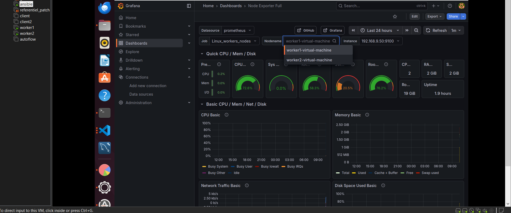
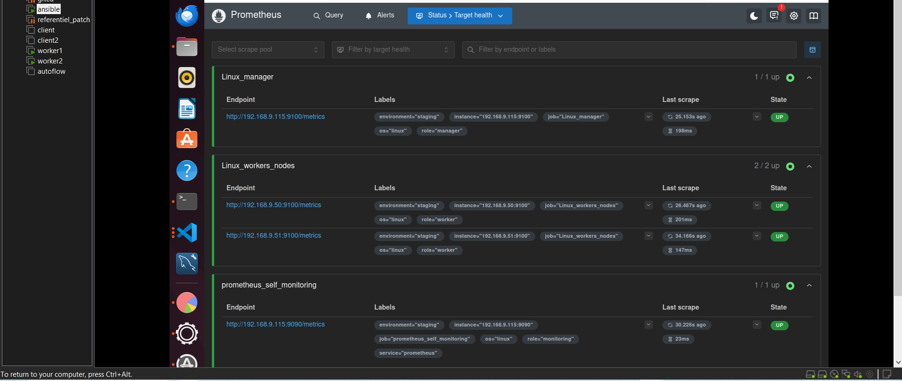

<h1 align="center"> Infrastructure Management and Monitoring with Ansible, Prometheus, and Grafana. </h1>

# Project in progress
> Previous Ansible playbooks are no longer included in this version due to updates in the `ansible.cfg` configuration and project structure.

---

##  Output

    - Install ansible on the manager node
    - set up manager and worker nodes
    - Deploy Prometheus and Grafana using docker compose on the Manager
    - Install and configure prometheus-node-exporter on Manager and worker nodes using ansible
    - Define infrastructure sizing and network configuration

## Expected outcome

    - Collect metrics on Manager and worker nodes
    - Automate infrastructure management to reduce manual tasks
    - Retreive Manager and worker nodes data to avoid downtime issues

---

## Use Case

    This project demonstrates how to automate infrastructure management and monitoring in a small production-like environment using Ansible, Prometheus, and Grafana.

    It can be used by system administrators or DevOps engineers to:
    - Monitor multiple servers in real time
    - Automate deployment and configuration tasks
    - Improve infrastructure reliability and visibility
---

## Architecture

    - 1 Manager node (Ansible + Prometheus + Grafana)
    - 2 Worker nodes (Node Exporter installed)
    - Communication via SSH
    - Metrics collected via HTTP endpoints
---

## Project structure


```text
ansible-automation/
├── Images/                         # Screenshots and project diagrams
├── inventory/              
│   ├── group_vars/
│   │   ├── all.yml                 # Common variables for all Servers
│   │   └── workers.yml             # Workers group variables
│   ├── host_vars/           
│   │   ├── worker1.yml             # Worker1-specific configuration
│   │   └── worker2.yml             # Worker2-specific configuration
|   ├── staging/
|   └── └── hosts.yml               # Inventory file for staging environment
├── monitoring/
|   ├── .env.example                # Grafana credentials example configuration
|   ├── .gitignore                  # .gitignore rules in monitoring directory
|   ├── docker-compose.yml          # docker-compose.yml configuration (Prometheus & Grafana services)
|   ├── prometheus.yml              # This file controls how Prometheus monitors your infrastructure
├── playbook/               
│   ├── cleanup.yml                 # Playbook file for cleaning
│   ├── common.yml                  # Base configuration shared across all groups
│   ├── create_user.yml             # Automates SSH user creation and management
│   ├── install.yml                 # Primary installation playbook
|   ├── node_exporter_install.yml   # Installs and configures Prometheus Node Exporter
│   ├── ping.yml                    # Simple connectivity test
│   └── uninstall.yml               # Désinstallation de différents paquets
├── .gitignore                      # Defines files and directories excluded from version control
├── ansible.cfg                     # Custom Ansible settings and defaults
└── README.md                       # Project description

```
---

## 🛠️ tools used

    - Linux as operating system (Ubuntu LTS 22.04)
    - Ansible for automation
    - Git for versioning
    - SSH for remote connection
    - YAML language for file cpnfiguration
    - Prometheus to collect metrics on manager and worker nodes
    - Grafana for data vizualisation

---
## ▶️ Playbook execution (old configuration).

> 1. Connectivity test on worker nodes (worker1 et worker2)

```bash
ansible all -i inventory/hosts.yml -m ping

```
---

> 2. Install Packages on worker1 with install_A as tag

```bash
ansible-playbook -i inventory/hosts.yml playbook/install.yml --tags="install_A"

```

---

> 3. Install Packages on worker2 with install_B as tag

```bash
ansible-playbook -i inventory/hosts.yml playbook/common.yml --tags="install_B"

```

> Playbook execution ( New configuration)

As mentionned in the begining, inventory directory and ansible.cfg file has been update, the execution 

```bash
ansible-playbook playbook/node_exporter_install.yml

```
## Monitoring overview

### Grafana Dashboard

Visualization of system metrics collected from manager and worker nodes.



### Prometheus targets

List of monitored nodes and services with their current status.



---

## Future Improvements

- Add alerting with Alertmanager
- Integrate CI/CD pipeline
- etc ...

## 📫 CONTACT

[](mailto:jeanmarctshimbombo@gmail.com)
[](https://www.linkedin.com/in/jean-marc-ngandu-b60796222)
[](https://github.com/jeanmarctsh)
