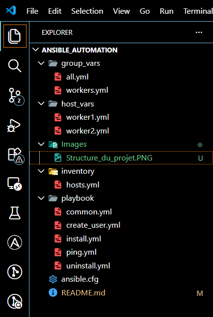

# 🚀 Ansible Automation 

> 🚧 Projet en cours de finition.....

---

## 🎯 Objectif

Ce projet vise à automatiser la gestion d'une infrastructure Linux avec Ansible, notamment :

    - Création d'un utilisateur ansible (rua) dédié pour une gestion centralisée et sécurisée,
    - Organiser la configuration avec group_vars et host_vars pour une meilleure scalabilité
    - Installation et gestion de paquets via le module apt,
    - Simplifier la configuration des serveurs et réduire les interventions manuelles
    - etc...

---

## 📁 Structure du projet

la structure générale du projet se présente de la manière suivante:



---

## 🛠️ technologies utilisées

    - Linux (Ubuntu)
    - Ansible
    - Git
    - SSH
    - YAML

---
## ▶️ Exécution du Playbook

Pour l'exécution d'un Playbook, veuillez lancer la commande suivante:

```bash
ansible-playbook -i inventory/inventory.yml playbook/install.yml

---


## 📫 CONTACT

[](mailto:jeanmarctshimbombo@gmail.com)
[](https://www.linkedin.com/in/jean-marc-ngandu-b60796222)
[](https://github.com/jeanmarctsh)